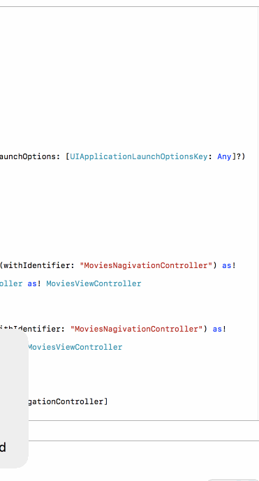

# Flicks

iOS codepath homework 1

Time spent: 10 hours

Completed user stories:

Required
- [x] User can view a list of movies currently playing in theaters from The Movie Database. Poster images must be loaded asynchronously.
- [x] User can view movie details by tapping on a cell.
- [x] User sees loading state while waiting for movies API
- [x] User sees an error message when there's a networking error. 
- [x] User can pull to refresh the movie list.

Optional

- [x] Add a tab bar for Now Playing or Top Rated movies
- [x] Add a search bar.
- [x] All images fade in as they are loading.
- [x] For the large poster, load the low-res image first and switch to high-res when complete.
- [x] Customize the highlight and selection effect of the cell.
- [x] Customize the navigation bar.

Gif Image

